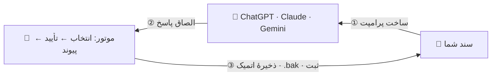

<div align="center">


# تکست سرجن

**ویرایشِ جراحیِ اسناد بلند، با کمک هوش مصنوعی.**<br>
هوش مصنوعی با حدود ۱۵ کلمه به بلوک «اشاره» می‌کند — موتورِ قطعی، کلِ بلوک را دقیق تا سطح بایت جایگزین می‌کند.

[](CHANGELOG.md)
[](https://www.python.org/)
[](CONTRIBUTING.md)
[](.github/workflows/ci.yml)
[](LICENSE)

[English](README.md) · **فارسی** · [简体中文](README.zh-CN.md)

</div>

---

<div dir="rtl">

## 🩻 مشکل

سندی ۵٬۰۰۰ کلمه‌ای را در چتِ هوش مصنوعی می‌گذارید و فقط *یک* تغییر می‌خواهید. مدل، کلِ سند را از نو تایپ می‌کند — کُند، گران، و با پاراگرافی که بی‌صدا گم شده است.

**تکست سرجن قرارداد را برعکس می‌کند.** هوش مصنوعی هرگز متن شما را دوباره نقل نمی‌کند؛ با دو لنگرِ کوتاه به بلوکِ موردنظر اشاره می‌کند و موتوری بدون هیچ وابستگی، جراحی را روی دستگاهِ خودِ شما انجام می‌دهد:

</div>

<div dir="ltr">

```text
@@EDIT anchor
START-ANCHOR: The migration process begins when
END-ANCHOR: and completes the rollback safely.
<<<
The migration is now a single atomic switchover, verified end-to-end.
>>>
```

</div>

<div dir="rtl">

موتور این انتخاب را به **دقیقاً یک** مکان می‌رساند — یا با داده‌های ترمیمِ ماشین‌خوان از عمل امتناع می‌کند — پیش از آن‌که حتی یک بایت جابه‌جا شود:

</div>

<div dir="ltr">

```text
SELECTION CONFIRMED   anchor · lines 42–118 · 77 lines · 4,210 chars · sha256 3f6ac1b2…
```

</div>

<div dir="rtl">

یازده کلمه ارجاع داده شد؛ هفتادوهفت خط جایگزین شد. آن ۴٬۹۰۰ خطِ دیگر هرگز دوباره تایپ نشدند — پس هرگز در خطر نبودند.

## 🚀 شروع سریع

**ویندوز — با یک کلیک.** روی `Start-Text-Surgeon.bat` دوبار کلیک کنید؛ اتاقِ عمل در مرورگر باز می‌شود: `http://127.0.0.1:8765`

**هر سیستم‌عاملی:**

</div>

<div dir="ltr">

```bash
python3 surgeon_web.py    # رابط مرورگر — English / فارسی، پشتیبانی کامل راست‌به‌چپ
```

</div>

<div dir="rtl">

> **نیازمندی: پایتون ۳٫۸ یا جدیدتر. فهرست همین‌جا تمام شد.** بدون pip — فقط کتابخانهٔ استاندارد.

### چرخهٔ کار

</div>



<div dir="rtl">

۱. فایل را باز کنید، درخواست تغییر را بنویسید ← **ساخت پرامپت** ← در هر چتِ هوش مصنوعی الصاق کنید.
۲. پاسخ کامل مدل را برگردانید ← **پیش‌نمایش** (امن؛ چیزی ذخیره نمی‌شود) ← **اعمال ویرایش**.
۳. فایل به‌صورت اتمیک با نسخهٔ پشتیبان `‎.bak` ذخیره می‌شود، عملیات در `‎.surgeon_memory.json` ثبت می‌شود و پرامپتِ راستی‌آزماییِ پس از عمل، آمادهٔ الصاق به هوش مصنوعی است.

ترمینال را ترجیح می‌دهید؟ بخش **خط فرمان** را در ادامه ببینید.

## 🔪 چهار ابزار جراحی

هر ویرایش = یک راهبرد انتخاب + یک جایگزینی. موتور هر کدام را که هوش مصنوعی به کار ببرد می‌پذیرد:

| ابزار | بهترین کاربرد | روش انتخاب |
|---|---|---|
| 🎯 `anchor` | بلوک‌های ≥ ۲ خط *(پیش‌فرض)* | ۵ تا ۱۰ کلمهٔ آغازین + ۵ تا ۱۰ کلمهٔ پایانیِ بلوک، هر یک با یکتاییِ **آماری** (دقیقاً یک تطبیقِ هم‌ترازِ واژه). بلوکی ۱٬۰۰۰ خطی با حدود ۱۵ کلمه نشانی داده می‌شود. |
| 🏷️ `tags` | ناحیه‌هایی که خودتان علامت می‌زنید | ویرایش فقط بین خطوط `[START_EDIT]` / `[END_EDIT]`، با هر نحوِ کامنتی. |
| 🧭 `context` | متن‌های تکراری و قالبی | تطبیق فازیِ ۱ تا ۵ خطِ اطرافِ بلوک، وقتی لنگر یکتایی وجود ندارد. در حالت تساوی به‌جای حدس‌زدن امتناع می‌کند. |
| ✂️ `verbatim` | ویرایش‌های ریز | جستجو/جایگزینی دقیقِ نسخهٔ ۱ — همچنان بهترین ابزار برای تغییر چند کلمه در یک جمله. |

لنگرِ مبهم؟ موتور متوقف می‌شود و **گسترش‌های یکتای ازپیش‌محاسبه‌شده** را برمی‌گرداند («سامانه» ← «سامانه توسط کاربر راه‌اندازی می‌شود») تا تلاشِ بعدی حتماً موفق شود.

## 🧤 آسیب نرسان — مدل ایمنی

انتخاب و تغییر، دو فازِ **جدا** هستند. تا وقتی همهٔ انتخاب‌های دسته تأیید نشده باشند، هیچ‌چیز نوشته نمی‌شود.

- **جراحیِ دوفازی** — هر ویرایش پیش از هر تغییری یک سطرِ `SELECTION CONFIRMED` می‌گیرد (محدودهٔ خط، اندازه، SHA-256)؛ گاردهای اختیاری (اثر SHA-256، سقف خطوط، محدودهٔ خط) اگر فایل در این میان تغییر کرده باشد، پیوند را رد می‌کنند.
- **دسته‌های تراکنشی** — ویرایش‌ها هم‌پوشانی‌سنجی می‌شوند و از پایین به بالا پیوند می‌خورند؛ هر خطا کلِ دسته را پیش از تغییرِ حتی یک نویسه لغو می‌کند.
- **نوشتنِ اتمیک** — تعویض با فایل موقت، نسخهٔ پشتیبان `‎.bak`، تاریخچهٔ عملیاتِ جدا برای هر فایل.
- **بهداشتِ بایت‌ها با موتور است** — سبک CRLF/LF، نشان BOM، خطِ پایانی، تورفتگی و فاصله‌های درز را موتور حفظ می‌کند و هرگز به هوش مصنوعی سپرده نمی‌شوند.
- **امتناع به‌جای حدس** — ۱۰ کد خطای ماشین‌خوان (`ANCHOR_NOT_UNIQUE`، `CONTEXT_ERROR`، `GUARD_FAILED`، …) که هر یک دادهٔ لازم برای ترمیمِ ویرایش را همراه دارد.

دستورِ کامل، راهبردها، گاردها و کدهای خطا در [SCHEMA.md](SCHEMA.md) آمده‌اند.

## 🪙 اقتصادِ توکن

از نسخهٔ ۲٫۲، مرحلهٔ ۱ دو حالتِ پرامپت دارد:

| حالت | چه چیزی ارسال می‌شود | چه وقت |
|---|---|---|
| **گفت‌وگوی تازه** | دستورالعمل + کلِ سند | نخستین پیامِ یک مکالمهٔ جدید |
| **همان گفت‌وگو** | فقط دستورالعملِ فشرده + خلاصهٔ ویرایش‌های اعمال‌شده از زمانِ اشتراکِ سند | هر پیگیری در همان مکالمه |

برای فایل‌های بزرگ یعنی صرفه‌جویی هزاران توکن در هر پیگیری (مثلاً **حدود ۵٬۵۰۰ ← حدود ۲۹۰ توکن**).

## 🌍 ساخته‌شده برای فارسی (و هر زبان دیگری)

تطبیق عمداً آسان‌گیر است تا انسان یا مدل بتواند متن را بدون بازتولیدِ جزئیاتِ نامرئی نقل کند — در حالی که **بایت‌های فایلِ شما بیرون از بلوکِ جایگزین‌شده هرگز بازنویسی نمی‌شوند**:

- **کشسان دربرابر نویسه‌های نامرئی** — نیم‌فاصله (ZWNJ)، ZWJ، فاصلهٔ صفرعرض، سافت‌هایفن، علامت‌های جهت‌نما و BOMهای سرگردان در تطبیق شفاف‌اند.
- **یکسان‌سازیِ هم‌ریخت‌ها** — ک/ك، ی/ي/ى، ة/ه، شکل‌های همزه‌دارِ الف، و ارقامِ فارسی/عربی/لاتین برای تطبیق یکی شمرده می‌شوند.
- **ایمن دربرابر نقل‌قول‌های تایپوگرافیک** — گیومه‌های فرفری‌ای که مدل‌ها جایگزین می‌کنند لنگر را نمی‌شکنند؛ گیومهٔ فارسی « » نشانهٔ نقل‌قولِ واقعی است و هرگز یکسان‌سازی نمی‌شود.
- **هم‌تراز با واژه‌ها** — تطبیق هرگز از میانِ یک واژهٔ بزرگ‌تر شروع یا تمام نمی‌شود؛ نشانه‌های تأکیدِ مارک‌داون (`**پررنگ**`، `_کج_`) مرز حساب می‌شوند، نه مانع.
- **مقاوم دربرابر پاسخ‌های راست‌به‌چپ** — پاسخ‌هایی که علامت‌های نامرئیِ جهت به فنس‌های `<<<` / `>>>` می‌چسبانند درست تجزیه می‌شوند؛ فنس‌های شلخته و کدبلاک‌های سراسری هم تحمل می‌شوند.

رابطِ وب هم دوزبانه است (English / فارسی) با پشتیبانی کامل از راست‌به‌چپ.

## ⌨️ خط فرمان

</div>

<div dir="ltr">

```bash
python3 text_surgeon.py notes.md --generate "بخش دوم را بازنویسی کن"   # ساخت پرامپت
python3 text_surgeon.py notes.md --generate "فشرده‌ترش کن" --followup   # پرامپت فشردهٔ «همان گفت‌وگو»
python3 text_surgeon.py notes.md --apply response.txt --dry-run         # فقط پیش‌نمایش انتخاب‌ها
python3 text_surgeon.py notes.md --apply response.txt                   # انجام جراحی
python3 text_surgeon.py notes.md --suggest-anchors 120:180              # لنگرهای یکتا برای یک بازهٔ خط
python3 text_surgeon.py notes.md --history                              # پروندهٔ بیمار
```

</div>

<div dir="rtl">

پرامپت‌ها به **stdout** می‌روند و پیام‌های وضعیت به **stderr** — پس هدایتِ خروجی در شل تمیز می‌ماند. کدهای خروج: `0` موفقیت، `1` خطای کاربرد، `2` توقفِ جراحی (در توقف، سند هرگز تغییر نمی‌کند).

## 🟨 پورت جاوااسکریپت

ابزارِ لنگر به‌صورت یک ماژولِ بدون وابستگیِ جاوااسکریپت هم عرضه می‌شود (`surgeon_anchor.js`، Node و مرورگر) که رفتار و کدهای خطای موتورِ پایتون را عیناً بازتاب می‌دهد:

</div>

<div dir="ltr">

```js
const { applyAnchorEdit } = require("./surgeon_anchor.js");

const { text, selection } = applyAnchorEdit(doc, {
  startAnchor: "The migration process begins when",
  endAnchor:   "and completes the rollback safely.",
  replace:     "The migration is now a single atomic switchover.",
});
// selection.status === "SELECTION_CONFIRMED"
```

</div>

<div dir="rtl">

## 🧪 آزمون‌ها

۱۳۳ آزمون، بدون هیچ وابستگیِ آزمایشی:

</div>

<div dir="ltr">

```bash
python3 -m unittest             # ۱۱۵ آزمون — موتور، خط فرمان، روند وب
node test_surgeon_anchor.js     #  ۱۸ آزمون — برابریِ پورت JS (شامل یکسان‌سازی فارسی)
```

</div>

<div dir="rtl">

یکپارچه‌سازیِ مداوم هر دو مجموعه را روی لینوکس و ویندوز و روی چند نسخهٔ پایتون و Node اجرا می‌کند — [`‎.github/workflows/ci.yml`](.github/workflows/ci.yml) را ببینید.

## 🗂️ کالبدشناسی

</div>

<div dir="ltr">

```text
TextSurgeon/
├── text_surgeon.py          # هستهٔ روندِ کار + خط فرمان (پرامپت، اعمال، ثبت تاریخچه)
├── surgeon_engine.py        # موتور انتخاب و پیوند — هر چهار ابزار
├── surgeon_anchor.js        # پورت JS راهبرد لنگر (Node + مرورگر)
├── surgeon_web.py           # سرور وب محلی (فقط کتابخانهٔ استاندارد)
├── surgeon_ui.html          # اتاق عمل — رابط مرورگر، EN/FA، راست‌به‌چپ
├── Start-Text-Surgeon.bat   # راه‌انداز تک‌کلیکی ویندوز
├── SCHEMA.md                # پروتکل جراح نسخهٔ ۲ — شِمای کامل ویرایش
├── test_surgeon_engine.py   # آزمون‌های واحد موتور
├── test_text_surgeon.py     # آزمون‌های یکپارچگی
└── test_surgeon_anchor.js   # آزمون‌های پورت JS
```

</div>

<div dir="rtl">

> **نکته:** فایل‌های اجرایی عمداً بدون پوشه‌بندی و کنار هم‌اند — همه را در یک پوشه نگه دارید؛ راه‌اندازِ تک‌کلیکی همین‌طور کار می‌کند.

## 🔒 حریم خصوصی

همه‌چیز روی `127.0.0.1` اجرا می‌شود — فقط دستگاهِ خودتان. اسنادِ شما هرگز توسط این ابزار جایی بارگذاری نمی‌شوند؛ تنها ترافیکِ شبکه همان پرامپتی است که *خودتان* در چتِ دلخواه‌تان الصاق می‌کنید.

## 📜 مجوز

[MIT](LICENSE) — بردارید، فورک کنید، رویش جراحی کنید.

</div>

---

<div align="center">

**اگر تکست سرجن سندتان را نجات داد، یک ⭐ بدهید — بیمار زنده ماند.**

*اشاره کن، نقل نکن.*

</div>
