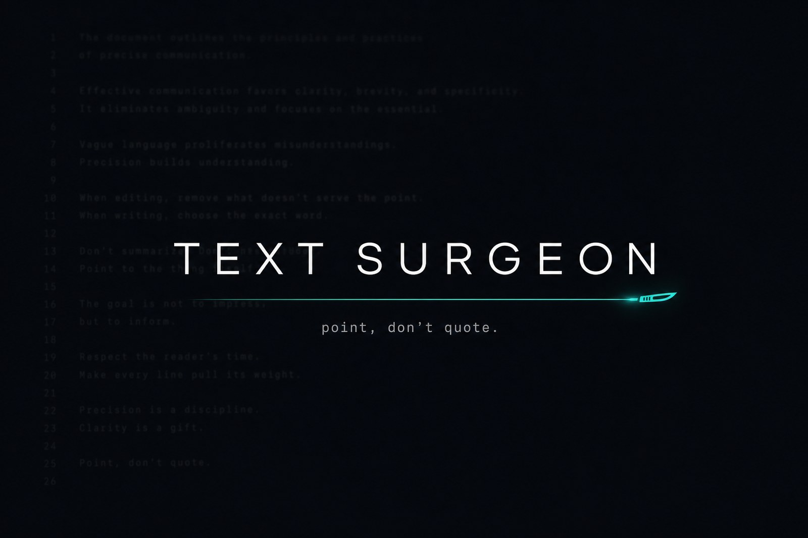
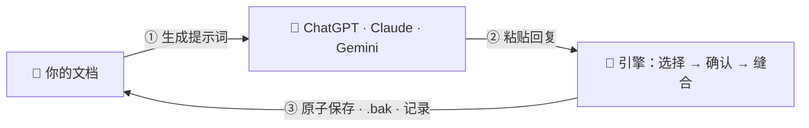

<div align="center">



# Text Surgeon · 文本外科医生

**为长文档而生的「外科手术式」AI 辅助编辑。**<br>
AI 只用约 15 个词指出目标块 —— 确定性引擎精确到字节地完成整块替换。

[](CHANGELOG.md)
[](https://www.python.org/)
[](CONTRIBUTING.md)
[](.github/workflows/ci.yml)
[](LICENSE)

[English](README.md) · [فارسی](README.fa.md) · **简体中文**

</div>

---

## 🩻 问题所在

你把一份 5,000 词的文档粘贴进 AI 对话，只想改*一处*。模型却把整份文档重新打一遍 —— 又慢、又贵，还悄悄丢了一个段落。

**Text Surgeon 反转了这份契约。** AI 从不复述你的原文，只用两个简短的锚点*指向*要修改的块；一个零依赖引擎在你自己的机器上完成这台手术：

```text
@@EDIT anchor
START-ANCHOR: The migration process begins when
END-ANCHOR: and completes the rollback safely.
<<<
The migration is now a single atomic switchover, verified end-to-end.
>>>
```

在移动任何一个字节之前，引擎必须把该选区解析到**恰好一个**位置 —— 否则拒绝执行，并返回机器可读的修复数据：

```text
SELECTION CONFIRMED   anchor · lines 42–118 · 77 lines · 4,210 chars · sha256 3f6ac1b2…
```

引用了 11 个词，替换了 77 行。其余 4,900 行从未被重新输入 —— 因此从未处于风险之中。

## 🚀 快速开始

**Windows —— 一键启动。** 双击 `Start-Text-Surgeon.bat`，「手术室」将在浏览器中打开：`http://127.0.0.1:8765`。

**任意操作系统：**

```bash
python3 surgeon_web.py    # 浏览器界面 —— 英语 / 波斯语，完整 RTL 支持
```

> **环境要求：Python 3.8+。清单到此为止。** 无需 pip 安装 —— 仅用标准库。

### 工作循环



1. 打开文件，写下修改需求 → **生成提示词** → 粘贴到任意 AI 对话。
2. 把 AI 的完整回复粘贴回来 → **预览**（安全，不保存任何内容）→ **应用编辑**。
3. 文件以原子方式保存并附带 `.bak` 备份，操作记录写入 `.surgeon_memory.json`，同时生成一份「术后核查」提示词，可直接粘贴回 AI 复查。

偏爱终端？请看下方 **命令行** 一节。

## 🔪 四件手术器械

一次编辑 = 一种选择策略 + 一段替换文本。AI 用哪件，引擎就接哪件：

| 器械 | 适用场景 | 选择方式 |
|---|---|---|
| 🎯 `anchor` | ≥ 2 行的块*（默认）* | 块的开头 5–10 词 + 结尾 5–10 词，每个锚点都必须**统计唯一**（恰好一个按词对齐的匹配）。1,000 行的块只需约 15 个词即可定位。 |
| 🏷️ `tags` | 你预先标记的区域 | 仅编辑 `[START_EDIT]` / `[END_EDIT]` 标记行之间的内容，任何注释语法均可。 |
| 🧭 `context` | 重复的模板文本 | 当不存在唯一锚点时，模糊匹配块*周围*的 1–5 行。打平时拒绝执行，绝不猜测。 |
| ✂️ `verbatim` | 微小改动 | v1 式精确查找/替换 —— 修改一句话里的几个词，它依然是最好的工具。 |

锚点有歧义？引擎中止操作，并返回**预先计算好的唯一扩展锚点**（`"The system is"` → `"The system is initialized by the user"`），让下一次尝试必然成功。

## 🧤 不造成伤害 —— 安全模型

选择与写入是**分离的两个阶段**。在整批选区全部确认之前，不写入任何内容。

- **两阶段手术** —— 每个编辑在落盘前都会得到一行 `SELECTION CONFIRMED`（行号范围、大小、SHA-256）；可选防护栏（`expected_sha256`、`max_lines`、行号范围）会在文件已被外部改动时拒绝缝合。
- **事务性批处理** —— 编辑经过重叠检查，自下而上依次缝合；任何一个错误都会在改动任何一个字符之前中止整批操作。
- **原子化写入** —— 临时文件交换、`.bak` 安全副本、按文件独立的操作历史。
- **字节卫生由引擎负责** —— CRLF/LF 风格、BOM、末尾换行、缩进与接缝处的空白全部由引擎保持，绝不托付给 AI。
- **宁拒绝，不猜测** —— 10 种机器可读的错误码（`ANCHOR_NOT_UNIQUE`、`CONTEXT_ERROR`、`GUARD_FAILED` 等），每一种都附带修复该编辑所需的数据。

完整的语法、策略、防护栏与错误码见 [SCHEMA.md](SCHEMA.md)。

## 🪙 Token 经济学

自 v2.2 起，第一步提供两种提示词模式：

| 模式 | 发送内容 | 使用时机 |
|---|---|---|
| **新对话** | 指令 + 整份文档 | 一段全新 AI 对话的第一条消息 |
| **同一对话** | 仅精简指令 —— 外加文档共享后已应用编辑的摘要 | 同一对话中的每次后续请求 |

对大文件而言，每次后续请求可节省数千 Token（例如 **约 5,500 → 约 290 Token**）。

## 🌍 为多语言文本而生

在波斯语上久经实战 —— 匹配刻意宽容，让人或模型无需复现不可见的细节即可引用文本；同时**被替换块之外的文件字节永远不会被改写**：

- **不可见字符弹性** —— 软连字符、ZWNJ/ZWJ、零宽空格、双向文本标记与游离的 BOM 对匹配完全透明。
- **形近字折叠** —— 阿拉伯语 kaf ↔ 波斯语 keheh、阿拉伯语 yeh / alef-maksura ↔ 波斯语 yeh、teh-marbuta ↔ heh，以及阿拉伯/波斯/ASCII 数字一律统一处理。
- **智能引号安全** —— 模型爱替换的弯引号（`“”` `‘’`）不再破坏锚点；波斯语书名号 « » 被尊重为真正的引号，永不折叠。
- **按词对齐** —— `the system` 绝不会匹配到 `the systematic` 内部；紧贴单词的 Markdown 强调符号（`**粗体**`、`_斜体_`）被视作边界而非障碍。
- **RTL 加固解析** —— AI 回复在 `<<<` / `>>>` 围栏上附着不可见方向标记时依然能正确解析；不规范的围栏与整段代码块包裹也都能容忍。

Web 界面本身即为双语（英语 / 波斯语），完整支持从右到左排版。

## ⌨️ 命令行

```bash
python3 text_surgeon.py notes.md --generate "重写第 2 节"          # 生成提示词
python3 text_surgeon.py notes.md --generate "再精炼一些" --followup  # 「同一对话」精简提示词
python3 text_surgeon.py notes.md --apply response.txt --dry-run    # 仅预览选区
python3 text_surgeon.py notes.md --apply response.txt              # 执行手术
python3 text_surgeon.py notes.md --suggest-anchors 120:180         # 为行区间推荐唯一锚点
python3 text_surgeon.py notes.md --history                         # 查看病历
```

提示词输出到 **stdout**，状态信息输出到 **stderr** —— shell 重定向始终干净。退出码：`0` 成功，`1` 用法错误，`2` 手术中止（中止时文档绝不会被修改）。

## 🟨 JavaScript 移植版

锚点器械同时以零依赖 JS 模块提供（`surgeon_anchor.js`，Node + 浏览器），完整镜像 Python 引擎的语义与错误码：

```js
const { applyAnchorEdit } = require("./surgeon_anchor.js");

const { text, selection } = applyAnchorEdit(doc, {
  startAnchor: "The migration process begins when",
  endAnchor:   "and completes the rollback safely.",
  replace:     "The migration is now a single atomic switchover.",
});
// selection.status === "SELECTION_CONFIRMED"
```

## 🧪 测试

133 个测试，零测试依赖：

```bash
python3 -m unittest             # 115 个测试 —— 引擎、命令行、Web 工作流
node test_surgeon_anchor.js     #  18 个测试 —— JS 移植版一致性（含波斯语折叠）
```

持续集成会在 Linux + Windows 上跨多个 Python 与 Node 版本运行两套测试 —— 见 [`.github/workflows/ci.yml`](.github/workflows/ci.yml)。

## 🗂 项目解剖

```text
TextSurgeon/
├── text_surgeon.py          # 工作流核心 + 命令行（提示词、应用、历史记录）
├── surgeon_engine.py        # 选择与缝合引擎 —— 全部四件器械
├── surgeon_anchor.js        # 锚点策略的 JS 移植版（Node + 浏览器）
├── surgeon_web.py           # 本地 Web 服务器（仅标准库）
├── surgeon_ui.html          # 手术室 —— 浏览器界面，英/波双语，RTL
├── Start-Text-Surgeon.bat   # Windows 一键启动器
├── SCHEMA.md                # 外科协议 v2 —— 完整编辑模式定义
├── test_surgeon_engine.py   # 引擎单元测试
├── test_text_surgeon.py     # 集成测试
└── test_surgeon_anchor.js   # JS 移植版测试
```

> **注意：** 运行时文件刻意保持扁平结构 —— 请将它们并排放在同一个文件夹中，一键启动器正是依赖这一点工作的。

## 🔒 隐私

一切都运行在 `127.0.0.1` 上 —— 仅限你自己的机器。本工具绝不会把你的文档上传到任何地方；唯一的网络流量，是*你自己*复制粘贴到所选 AI 对话里的那段提示词。

## 📜 许可证

[MIT](LICENSE) —— 拿去用、随意 fork、放上手术台。

---

<div align="center">

**如果 Text Surgeon 救了你的文档，请留下一颗 ⭐ —— 病人活下来了。**

*只指位置，不引原文。*

</div>
